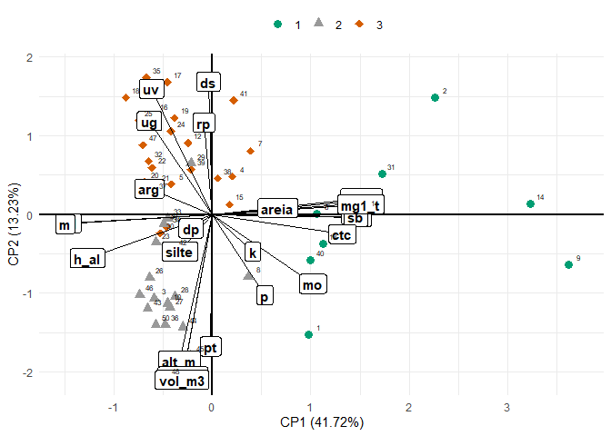

Multivariada
================
Montanari e Nilton
2024-08-17

<!-- README.md is generated from README.Rmd. Please edit that file -->

## Carregando pacotes

``` r
library(readxl)
library(tidyverse)
library(janitor)
library(skimr)
library(vegan)
library(corrplot)
source("R/my-functions.R")
theme_set(theme_bw())
```

## Carregando os Bancos de dados

``` r
data_set <- readr::read_rds("data/data_set.rds")
```

### Estatística descritiva

``` r
skim(data_set)
```

|                                                  |          |
|:-------------------------------------------------|:---------|
| Name                                             | data_set |
| Number of rows                                   | 150      |
| Number of columns                                | 51       |
| \_\_\_\_\_\_\_\_\_\_\_\_\_\_\_\_\_\_\_\_\_\_\_   |          |
| Column type frequency:                           |          |
| character                                        | 1        |
| numeric                                          | 50       |
| \_\_\_\_\_\_\_\_\_\_\_\_\_\_\_\_\_\_\_\_\_\_\_\_ |          |
| Group variables                                  | None     |

Data summary

**Variable type: character**

| skim_variable | n_missing | complete_rate | min | max | empty | n_unique | whitespace |
|:--------------|----------:|--------------:|----:|----:|------:|---------:|-----------:|
| tratamento    |         0 |             1 |   8 |  11 |     0 |        3 |          0 |

**Variable type: numeric**

| skim_variable | n_missing | complete_rate |       mean |       sd |         p0 |        p25 |        p50 |        p75 |       p100 | hist  |
|:--------------|----------:|--------------:|-----------:|---------:|-----------:|-----------:|-----------:|-----------:|-----------:|:------|
| pontos        |         0 |             1 |      25.50 |    14.48 |       1.00 |      13.00 |      25.50 |      38.00 |      50.00 | ▇▇▇▇▇ |
| s_em_graus    |         0 |             1 |  339953.31 | 35674.45 |   34397.00 |  343915.00 |  343944.50 |  343974.75 |  363439.00 | ▁▁▁▁▇ |
| w_em_graus    |         0 |             1 | 7737049.51 |    59.55 | 7736705.00 | 7737006.25 | 7737036.00 | 7737112.00 | 7737145.00 | ▁▁▁▇▅ |
| altitude      |         0 |             1 |     393.09 |     2.80 |     387.00 |     391.00 |     393.00 |     395.00 |     400.00 | ▂▇▆▅▂ |
| alt_m         |         0 |             1 |       3.38 |     0.77 |       0.90 |       3.00 |       3.40 |       4.00 |       4.70 | ▁▂▃▇▆ |
| dap_m         |         0 |             1 |       0.02 |     0.01 |       0.00 |       0.00 |       0.02 |       0.03 |       0.04 | ▇▂▃▆▂ |
| vol_m3        |         0 |             1 |       0.00 |     0.00 |       0.00 |       0.00 |       0.00 |       0.00 |       0.01 | ▆▇▇▃▃ |
| rp1           |         0 |             1 |       0.82 |     0.43 |       0.55 |       0.55 |       0.65 |       0.89 |       2.64 | ▇▁▁▁▁ |
| rp2           |         0 |             1 |       3.42 |     1.22 |       1.06 |       2.67 |       3.25 |       3.92 |      10.47 | ▆▇▁▁▁ |
| ug1           |         0 |             1 |       0.03 |     0.01 |       0.01 |       0.02 |       0.03 |       0.03 |       0.05 | ▃▆▇▅▁ |
| ug2           |         0 |             1 |       0.04 |     0.01 |       0.02 |       0.03 |       0.04 |       0.04 |       0.07 | ▃▇▇▁▁ |
| uv2           |         0 |             1 |       0.06 |     0.01 |       0.03 |       0.05 |       0.05 |       0.06 |       0.09 | ▃▇▇▂▁ |
| ds2           |         0 |             1 |       1.44 |     0.11 |       1.06 |       1.36 |       1.44 |       1.51 |       1.79 | ▁▃▇▃▁ |
| dp1           |         0 |             1 |       2.69 |     0.04 |       2.53 |       2.67 |       2.70 |       2.70 |       2.78 | ▁▁▇▇▃ |
| dp2           |         0 |             1 |       2.70 |     0.04 |       2.60 |       2.67 |       2.70 |       2.74 |       2.90 | ▁▇▃▁▁ |
| pt2           |         0 |             1 |       0.47 |     0.04 |       0.34 |       0.44 |       0.47 |       0.50 |       0.60 | ▁▃▇▃▁ |
| areia1        |         0 |             1 |     895.82 |    10.59 |     871.00 |     887.50 |     894.75 |     903.37 |     927.50 | ▂▇▆▃▁ |
| areia2        |         0 |             1 |     890.28 |    11.39 |     871.00 |     881.63 |     888.00 |     896.87 |     921.00 | ▅▇▅▂▂ |
| arg1          |         0 |             1 |      72.75 |     6.99 |      58.60 |      68.33 |      72.40 |      77.20 |      97.60 | ▃▇▆▂▁ |
| arg2          |         0 |             1 |      79.16 |     7.82 |      57.30 |      73.27 |      81.05 |      84.80 |      93.50 | ▁▂▅▇▃ |
| silte1        |         0 |             1 |      31.44 |     7.20 |      10.30 |      26.40 |      32.60 |      36.65 |      53.70 | ▁▅▇▅▁ |
| silte2        |         0 |             1 |      30.56 |     6.72 |      12.30 |      26.20 |      31.65 |      35.55 |      49.20 | ▁▃▇▆▁ |
| p1            |         0 |             1 |       2.81 |     1.36 |       1.00 |       2.00 |       3.00 |       3.00 |      14.00 | ▇▁▁▁▁ |
| p2            |         0 |             1 |       1.89 |     0.79 |       1.00 |       1.00 |       2.00 |       2.00 |       7.00 | ▇▁▁▁▁ |
| mo1           |         0 |             1 |      11.39 |     1.52 |       8.00 |      10.00 |      11.00 |      12.00 |      18.00 | ▃▇▂▁▁ |
| mo2           |         0 |             1 |       9.81 |     1.01 |       8.00 |       9.00 |      10.00 |      10.00 |      13.00 | ▇▆▂▁▁ |
| p_h1          |         0 |             1 |       4.38 |     0.63 |       2.90 |       3.92 |       4.20 |       4.70 |       7.30 | ▁▇▂▁▁ |
| ph2           |         0 |             1 |       4.17 |     0.38 |       2.80 |       3.90 |       4.00 |       4.30 |       5.60 | ▁▃▇▂▁ |
| k1            |         0 |             1 |       0.76 |     0.40 |       0.10 |       0.50 |       0.70 |       0.88 |       2.40 | ▅▇▂▁▁ |
| k2            |         0 |             1 |       0.61 |     0.32 |       0.20 |       0.40 |       0.50 |       0.70 |       2.80 | ▇▂▁▁▁ |
| ca1           |         0 |             1 |       8.22 |    10.28 |       1.00 |       1.00 |       3.50 |      11.75 |      60.00 | ▇▂▁▁▁ |
| ca2           |         0 |             1 |       4.27 |     5.86 |       1.00 |       1.00 |       2.00 |       5.00 |      45.00 | ▇▁▁▁▁ |
| mg1           |         0 |             1 |       6.51 |     6.31 |       1.00 |       2.00 |       4.00 |       9.00 |      30.00 | ▇▂▁▁▁ |
| mg2           |         0 |             1 |       3.63 |     3.80 |       1.00 |       1.00 |       2.00 |       4.00 |      26.00 | ▇▁▁▁▁ |
| h_al1         |         0 |             1 |      24.05 |     5.94 |       8.00 |      19.00 |      25.00 |      29.00 |      36.00 | ▁▆▅▇▅ |
| h_al2         |         0 |             1 |      23.19 |     4.20 |      15.00 |      20.00 |      24.00 |      26.00 |      38.00 | ▅▆▇▂▁ |
| al1           |         0 |             1 |       8.90 |     5.27 |       0.00 |       4.25 |      10.00 |      14.00 |      17.00 | ▆▅▅▆▇ |
| al2           |         0 |             1 |      10.97 |     4.59 |       0.00 |       8.00 |      12.00 |      15.00 |      16.00 | ▁▂▂▃▇ |
| sb1           |         0 |             1 |      15.49 |    16.50 |       2.20 |       3.73 |       8.70 |      21.70 |      90.50 | ▇▂▁▁▁ |
| sb2           |         0 |             1 |       8.51 |     9.58 |       2.20 |       2.62 |       4.80 |      10.25 |      71.50 | ▇▁▁▁▁ |
| ctc1          |         0 |             1 |      39.55 |    12.57 |      24.50 |      32.55 |      36.05 |      42.70 |      98.50 | ▇▂▁▁▁ |
| ctc2          |         0 |             1 |      31.70 |     7.97 |      23.40 |      28.30 |      29.85 |      32.65 |      86.50 | ▇▁▁▁▁ |
| v1            |         0 |             1 |      33.14 |    23.65 |       6.25 |      11.75 |      24.89 |      52.02 |      91.88 | ▇▃▂▂▁ |
| v2            |         0 |             1 |      23.84 |    17.34 |       7.28 |      10.10 |      17.20 |      34.50 |      82.66 | ▇▂▂▁▁ |
| ca1_t1        |         0 |             1 |      16.88 |    15.01 |       2.58 |       3.52 |      10.29 |      27.99 |      60.91 | ▇▂▂▂▁ |
| ca1_t2        |         0 |             1 |      11.61 |    10.70 |       2.91 |       3.51 |       6.39 |      17.59 |      52.02 | ▇▂▂▁▁ |
| mg1_t1        |         0 |             1 |      14.22 |     9.15 |       2.59 |       6.54 |      11.42 |      22.07 |      34.65 | ▇▅▂▃▂ |
| mg1_t2        |         0 |             1 |      10.28 |     7.16 |       2.98 |       3.88 |       7.38 |      14.37 |      34.30 | ▇▃▂▁▁ |
| m1            |         0 |             1 |      47.23 |    31.18 |       0.00 |      16.25 |      53.00 |      78.00 |      88.00 | ▆▃▂▃▇ |
| m2            |         0 |             1 |      61.41 |    26.54 |       0.00 |      43.50 |      72.00 |      84.00 |      88.00 | ▂▂▂▂▇ |

# Análise Multivariada - Por tratamento e por profundidade

``` r
data_set <- data_set %>% 
  pivot_longer(cols = rp1:m2) %>% 
  mutate(
    variavel = str_remove(name,".$"),
    prof = str_sub(name,-1,-1)
  )
```

``` r
tratamentos <- data_set %>% pull(tratamento) %>% unique()
for(i in seq_along(tratamentos)){
  for(j in 1:2){
    my_trat <- tratamentos[i]
    da <- data_set %>% 
      select(-name) %>% 
      filter(
        tratamento == my_trat,
        prof == j
        ) %>% 
      pivot_wider(values_from = value, names_from = variavel)

    nomes <- da %>% 
        pull(pontos)
    da <- da %>% select(alt_m:m, -prof)
    mc <- da %>%  cor()
    
    print("##########################################")
    print(paste0("     Tratamento: ",tratamentos[i]))
    print(paste0("     Profundidade: ",j))
    print("##########################################")
    print("======== Análise de correlação linear ========== ")
    corrplot::corrplot(mc)
    
    print("======== Análise de Agrupamento Hierárquico ========== ")
    da_pad<-decostand(da, 
                      method = "standardize",
                      na.rm=TRUE)
    da_pad_euc<-vegdist(da_pad,"euclidean") 
    da_pad_euc_ward<-hclust(da_pad_euc, method="ward.D")
    plot(da_pad_euc_ward, 
         ylab="Distância Euclidiana",
         xlab="Acessos", hang=-1,
         col="blue", las=1,
         cex=.6,lwd=1.5);box()
    grupo<-cutree(da_pad_euc_ward,3)
    
    
    print("======== Análise de Componentes Principais ========== ")
    pca <-  prcomp(da_pad,scale.=T)
    # Autovalores
    eig<-pca$sdev^2
    print("==== Autovalores ====")
    print(round(eig,3))
    print("==== % da variância explicada ====")
    ve<-eig/sum(eig)
    print(round(ve,4))
    print("==== % da variância explicada acumulada ====")
    print(round(cumsum(ve),4)*100)
    print("==== Poder Discriminante ====")
    mcor<-cor(da_pad,pca$x)
    corrplot(mcor)
    print("==== screeplot ====")
    screeplot(pca)
    abline(h=1)
    print("==== Gráfico Biplot ====")
    pc1V<-cor(da_pad,pca$x)[,1]/sd(cor(da_pad,pca$x)[,1])
    pc2V<-cor(da_pad,pca$x)[,2]/sd(cor(da_pad,pca$x)[,2])
    pc3V<-cor(da_pad,pca$x)[,3]/sd(cor(da_pad,pca$x)[,3])
    pc1c<-pca$x[,1]/sd(pca$x[,1])
    pc2c<-pca$x[,2]/sd(pca$x[,2])
    pc3c<-pca$x[,3]/sd(pca$x[,3])
    nv<-ncol(da) 
    
    bip<-data.frame(pc1c,pc2c,pc3c,nomes,grupo)
    texto <- data.frame(
      x = pc1V,
      y = pc2V,
      z = pc3V,
      label = names(da)
    )
    graf <- bip %>% 
      ggplot(aes(x=pc1c,y=pc2c,color=grupo))+
      geom_point(aes(shape = as_factor(grupo), color = as_factor(grupo)), size = 3) +
      theme_minimal() + 
      scale_shape_manual(values=16:18)+
      scale_color_manual(values=c("#009E73", "#999999","#D55E00"))+
      geom_vline(aes(xintercept=0),
                 color="black", size=1)+
      geom_hline(aes(yintercept=0),
                 color="black", size=1)+
      annotate(geom="segment",
               x=rep(0,length(da)),
               xend=texto$x,
               y=rep(0,length(da)),
               yend=texto$y,color="black",lwd=.5)+
      geom_label(data=texto,aes(x=x,y=y,label=label),
                 color="black",angle=0,fontface="bold",size=4,fill="white")+
      labs(x=paste("CP1 (",round(100*ve[1],2),"%)",sep=""),
           y=paste("CP2 (",round(100*ve[2],2),"%)",sep=""),
           color="",shape="")+
      theme(legend.position = "top")+
      annotate(geom="text",
               x=pc1c+.1,
               y=pc2c+.1,
               color="black",
               label = nomes,
               size = 2
      )
    print(graf)
    
    print("==== Tabela da correlação dos atributos com cada PC ====")
    ck<-sum(pca$sdev^2>=0.98)
    tabelapca<-vector()
    for( l in 1:ck) tabelapca<-cbind(tabelapca,mcor[,l])
    colnames(tabelapca)<-paste(rep(c("PC"),ck),1:ck,sep="")
    pcat<-round(tabelapca,3)
    tabelapca<-tabelapca[order(abs(tabelapca[,1])),]
    print(tabelapca)
  }
}
#> [1] "##########################################"
#> [1] "     Tratamento: Testemunha"
#> [1] "     Profundidade: 1"
#> [1] "##########################################"
#> [1] "======== Análise de correlação linear ========== "
```

<!-- -->

    #> [1] "======== Análise de Agrupamento Hierárquico ========== "

<!-- -->

    #> [1] "======== Análise de Componentes Principais ========== "
    #> [1] "==== Autovalores ===="
    #>  [1] 10.369  3.004  2.223  1.771  1.514  1.089  0.846  0.674  0.541  0.408
    #> [11]  0.224  0.138  0.093  0.042  0.026  0.020  0.017  0.001  0.000  0.000
    #> [21]  0.000  0.000  0.000
    #> [1] "==== % da variância explicada ===="
    #>  [1] 0.4508 0.1306 0.0967 0.0770 0.0658 0.0473 0.0368 0.0293 0.0235 0.0177
    #> [11] 0.0098 0.0060 0.0040 0.0018 0.0011 0.0009 0.0007 0.0001 0.0000 0.0000
    #> [21] 0.0000 0.0000 0.0000
    #> [1] "==== % da variância explicada acumulada ===="
    #>  [1]  45.08  58.14  67.81  75.51  82.09  86.82  90.50  93.43  95.78  97.56
    #> [11]  98.53  99.13  99.54  99.72  99.83  99.92  99.99 100.00 100.00 100.00
    #> [21] 100.00 100.00 100.00
    #> [1] "==== Poder Discriminante ===="

<!-- -->

    #> [1] "==== screeplot ===="
    #> [1] "==== Gráfico Biplot ===="
    #> Warning: Using `size` aesthetic for lines was deprecated in ggplot2 3.4.0.
    #> ℹ Please use `linewidth` instead.
    #> This warning is displayed once every 8 hours.
    #> Call `lifecycle::last_lifecycle_warnings()` to see where this warning was
    #> generated.

<!-- --><!-- -->

    #> [1] "==== Tabela da correlação dos atributos com cada PC ===="
    #>                PC1          PC2           PC3          PC4         PC5
    #> silte   0.01357842 -0.254913995 -0.6566712526  0.403552138 -0.23227877
    #> k       0.04657065 -0.161443621  0.3837275660  0.690957889  0.16054886
    #> rp      0.04918077  0.122274094 -0.0634107952  0.355300549 -0.60177729
    #> p       0.06856542 -0.337595774  0.4559664031  0.624524190 -0.10500757
    #> dp      0.08464479 -0.200839078 -0.1347750306  0.010002696 -0.71704040
    #> areia   0.08971671  0.323922627  0.8536000571 -0.359371166 -0.09428718
    #> mo      0.12734612 -0.265968651  0.2546080237  0.428660970  0.49054687
    #> arg    -0.15281707 -0.224059666 -0.6066969558  0.118403999  0.39564474
    #> alt_m  -0.18772818 -0.897588147  0.1071792154 -0.230996813 -0.01874335
    #> dap_m  -0.19588532 -0.930060169  0.1607967288 -0.192340979 -0.10006408
    #> vol_m3 -0.26129826 -0.888634102  0.1278107846 -0.226620068 -0.05138266
    #> ug     -0.62193164 -0.027833602 -0.4022303829 -0.074500032  0.17354135
    #> ctc     0.82269800 -0.124053212 -0.0613201324 -0.152401042  0.19300804
    #> h_al   -0.82486093  0.022259247  0.0610784656  0.031335508  0.21643307
    #> ca      0.94252516 -0.085510830 -0.1026636534 -0.188485653  0.04641853
    #> al     -0.95294083 -0.001131505 -0.0240355892 -0.129594656  0.03485298
    #> sb      0.95884526 -0.103310716 -0.0713050991 -0.128531055  0.05926774
    #> m      -0.96373633  0.036996194 -0.0463111867 -0.153057366 -0.03529313
    #> mg      0.96466432 -0.114258042 -0.0570095674 -0.097497814  0.06346670
    #> p_h     0.97313817 -0.004454775 -0.0334320471  0.012979559 -0.01805438
    #> mg1_t   0.97601612 -0.073467415  0.0002549059  0.061794491  0.02017517
    #> ca1_t   0.98010805 -0.015386831 -0.0834834584 -0.098617032  0.00822123
    #> v       0.99155810 -0.048935168 -0.0252381705  0.009319047  0.01811214
    #>                PC6
    #> silte  -0.36101308
    #> k       0.12672935
    #> rp      0.06956230
    #> p      -0.07668102
    #> dp     -0.16917362
    #> areia  -0.08113410
    #> mo     -0.31547432
    #> arg     0.51417988
    #> alt_m   0.14149181
    #> dap_m   0.01340721
    #> vol_m3  0.02696943
    #> ug     -0.33030540
    #> ctc    -0.38340899
    #> h_al   -0.39392957
    #> ca     -0.15154340
    #> al     -0.17079099
    #> sb     -0.13228961
    #> m      -0.07792322
    #> mg     -0.11240450
    #> p_h     0.09051425
    #> mg1_t   0.04663862
    #> ca1_t  -0.04180414
    #> v       0.01020194
    #> [1] "##########################################"
    #> [1] "     Tratamento: Testemunha"
    #> [1] "     Profundidade: 2"
    #> [1] "##########################################"
    #> [1] "======== Análise de correlação linear ========== "

<!-- -->

    #> [1] "======== Análise de Agrupamento Hierárquico ========== "

<!-- -->

    #> [1] "======== Análise de Componentes Principais ========== "
    #> [1] "==== Autovalores ===="
    #>  [1] 10.847  3.440  2.615  1.988  1.791  1.134  0.975  0.878  0.726  0.559
    #> [11]  0.358  0.236  0.154  0.111  0.096  0.033  0.028  0.027  0.002  0.001
    #> [21]  0.000  0.000  0.000  0.000  0.000  0.000
    #> [1] "==== % da variância explicada ===="
    #>  [1] 0.4172 0.1323 0.1006 0.0765 0.0689 0.0436 0.0375 0.0338 0.0279 0.0215
    #> [11] 0.0138 0.0091 0.0059 0.0043 0.0037 0.0013 0.0011 0.0010 0.0001 0.0000
    #> [21] 0.0000 0.0000 0.0000 0.0000 0.0000 0.0000
    #> [1] "==== % da variância explicada acumulada ===="
    #>  [1]  41.72  54.95  65.01  72.65  79.54  83.91  87.66  91.03  93.83  95.98
    #> [11]  97.35  98.26  98.85  99.28  99.65  99.78  99.88  99.99 100.00 100.00
    #> [21] 100.00 100.00 100.00 100.00 100.00 100.00
    #> [1] "==== Poder Discriminante ===="

<!-- -->

    #> [1] "==== screeplot ===="

<!-- -->

    #> [1] "==== Gráfico Biplot ===="

<!-- -->

    #> [1] "==== Tabela da correlação dos atributos com cada PC ===="
    #>                PC1          PC2         PC3         PC4           PC5
    #> pt     -0.01234686 -0.610085959  0.48558668 -0.30261670  0.4625901786
    #> ds     -0.02818053  0.612255493 -0.46566543  0.18861759 -0.5415629921
    #> rp     -0.05750385  0.423995476 -0.30444429  0.15781024 -0.0256438743
    #> dp     -0.13994114 -0.064503927  0.13077112 -0.44135721 -0.2610501887
    #> dap_m  -0.19392044 -0.748227859 -0.53951513  0.16582226 -0.2053998919
    #> vol_m3 -0.19893303 -0.764891273 -0.46833884  0.12182499 -0.2221343275
    #> silte  -0.21310905 -0.171506320 -0.49262615 -0.35256441  0.3112521873
    #> alt_m  -0.21550372 -0.675745880 -0.59539877  0.12446858 -0.1995593754
    #> k       0.26119316 -0.172849018  0.17001065  0.68956693  0.4377602976
    #> p       0.33838816 -0.373236527  0.15804567  0.60091626  0.0616093174
    #> uv     -0.39657076  0.580566619 -0.36811218  0.28698396  0.1989833811
    #> ug     -0.41043170  0.431614767 -0.24147556  0.28072797  0.4166555621
    #> arg    -0.41111279  0.119060393 -0.37461127 -0.04950484  0.4815591951
    #> areia   0.42388634  0.029837181  0.58151707  0.26493324 -0.5368428897
    #> mo      0.65209846 -0.320665915  0.13158681  0.41613987  0.0939761186
    #> h_al   -0.81248377 -0.202509845  0.20459441 -0.04553181  0.0004910887
    #> ctc     0.84323380 -0.089991676 -0.13543429 -0.23445766  0.1031394631
    #> ca      0.90759214 -0.000788793 -0.18454040 -0.24337621  0.0785659066
    #> ph      0.91499872  0.062442464 -0.09497196  0.01281957  0.1300773978
    #> al     -0.91608746 -0.040883179  0.09392084 -0.09877180 -0.0524740196
    #> sb      0.93100609 -0.011828217 -0.17195729 -0.17671277  0.0836503687
    #> mg      0.94064111 -0.013832487 -0.16608004 -0.12906712  0.0495509997
    #> m      -0.95740960 -0.044903250  0.03674532 -0.09470529  0.0104276170
    #> mg1_t   0.96263527  0.046631939 -0.09208233  0.06390505 -0.0544644590
    #> ca1_t   0.96600934  0.074761427 -0.11632259 -0.16732626 -0.0165931234
    #> v       0.98587054  0.052011367 -0.09468218 -0.02709711 -0.0002865446
    #>                PC6
    #> pt      0.15451219
    #> ds     -0.12650548
    #> rp     -0.14544108
    #> dp      0.10467317
    #> dap_m   0.11551465
    #> vol_m3  0.11094798
    #> silte  -0.31562620
    #> alt_m   0.10069306
    #> k      -0.17407823
    #> p      -0.06193921
    #> uv      0.44179373
    #> ug      0.51511021
    #> arg    -0.13719325
    #> areia   0.30143673
    #> mo      0.03503659
    #> h_al    0.16388446
    #> ctc     0.30882280
    #> ca      0.21726053
    #> ph     -0.10968889
    #> al      0.21008801
    #> sb      0.20131439
    #> mg      0.18995676
    #> m       0.13441028
    #> mg1_t  -0.02471491
    #> ca1_t   0.01889769
    #> v      -0.01414053
    #> [1] "##########################################"
    #> [1] "     Tratamento: Calcário"
    #> [1] "     Profundidade: 1"
    #> [1] "##########################################"
    #> [1] "======== Análise de correlação linear ========== "

<!-- -->

    #> [1] "======== Análise de Agrupamento Hierárquico ========== "

<!-- -->

    #> [1] "======== Análise de Componentes Principais ========== "
    #> [1] "==== Autovalores ===="
    #>  [1] 10.538  2.988  2.358  1.604  1.144  1.023  0.922  0.699  0.637  0.514
    #> [11]  0.321  0.115  0.074  0.037  0.022  0.004  0.002  0.001  0.000  0.000
    #> [21]  0.000  0.000  0.000
    #> [1] "==== % da variância explicada ===="
    #>  [1] 0.4582 0.1299 0.1025 0.0697 0.0497 0.0445 0.0401 0.0304 0.0277 0.0224
    #> [11] 0.0140 0.0050 0.0032 0.0016 0.0009 0.0002 0.0001 0.0000 0.0000 0.0000
    #> [21] 0.0000 0.0000 0.0000
    #> [1] "==== % da variância explicada acumulada ===="
    #>  [1]  45.82  58.81  69.06  76.03  81.00  85.45  89.46  92.50  95.27  97.50
    #> [11]  98.90  99.40  99.72  99.88  99.97  99.99 100.00 100.00 100.00 100.00
    #> [21] 100.00 100.00 100.00
    #> [1] "==== Poder Discriminante ===="

<!-- -->

    #> [1] "==== screeplot ===="

<!-- -->

    #> [1] "==== Gráfico Biplot ===="

<!-- -->

    #> [1] "==== Tabela da correlação dos atributos com cada PC ===="
    #>                PC1          PC2          PC3           PC4          PC5
    #> mo      0.01151278  0.111195889 -0.342835452 -0.5495416207  0.184541493
    #> areia  -0.02159560 -0.273661508  0.846587756 -0.4268002068 -0.069190210
    #> silte  -0.04113417  0.294180029 -0.812677826  0.2981276409 -0.209579083
    #> k      -0.06546399 -0.147749679 -0.505191950 -0.3440013999 -0.026282774
    #> dp      0.10618767 -0.021708765 -0.180382298 -0.4315510728  0.290223802
    #> arg     0.15103016  0.031992725 -0.323718316  0.4206993644  0.663409090
    #> rp     -0.17282910  0.018801297 -0.334121295 -0.1685530672 -0.677838125
    #> vol_m3 -0.21998878 -0.952968611 -0.153948674  0.0713701459 -0.002151635
    #> alt_m  -0.22114526 -0.957112228 -0.152052887  0.0736081212  0.001267338
    #> dap_m  -0.22114526 -0.957112228 -0.152052887  0.0736081212  0.001267338
    #> p      -0.29219370 -0.009701190 -0.446324328 -0.5844142849  0.134278537
    #> ug      0.66756165 -0.063791775 -0.171662154  0.2451157533 -0.191372872
    #> h_al    0.88301989 -0.007294184 -0.196333170 -0.2890860214  0.043538738
    #> ctc    -0.91186486  0.083362339 -0.045711103 -0.0756268026  0.015843231
    #> al      0.93044114 -0.027490183 -0.084489384  0.0218080311 -0.093137081
    #> m       0.93695199 -0.017841496  0.015484117 -0.0000632516 -0.029763886
    #> ca     -0.94129268  0.064759037  0.037894209  0.0054531398  0.026674573
    #> mg     -0.94639534  0.092485629 -0.041609305 -0.0208546027 -0.025987998
    #> sb     -0.94922988  0.073153171 -0.002941455 -0.0114975791  0.005567168
    #> p_h    -0.94924868  0.097051877  0.012434244  0.0218996382  0.071578744
    #> mg1_t  -0.95840262  0.078467266 -0.080439570  0.0519178407 -0.055496839
    #> ca1_t  -0.98165825  0.040126608  0.045552019  0.0779867072  0.002318904
    #> v      -0.98479729  0.048596009 -0.018079867  0.0593676753 -0.018614861
    #>                 PC6
    #> mo      0.464480034
    #> areia   0.018771272
    #> silte  -0.128450683
    #> k      -0.063192613
    #> dp     -0.624171694
    #> arg     0.247677251
    #> rp      0.250251471
    #> vol_m3  0.011111244
    #> alt_m   0.004642936
    #> dap_m   0.004642936
    #> p       0.049832919
    #> ug     -0.288194517
    #> h_al   -0.069089008
    #> ctc    -0.220282268
    #> al     -0.097048793
    #> m      -0.141559293
    #> ca     -0.163172535
    #> mg     -0.192918111
    #> sb     -0.176909101
    #> p_h     0.081794278
    #> mg1_t   0.003337712
    #> ca1_t   0.042132725
    #> v       0.030073789
    #> [1] "##########################################"
    #> [1] "     Tratamento: Calcário"
    #> [1] "     Profundidade: 2"
    #> [1] "##########################################"
    #> [1] "======== Análise de correlação linear ========== "

<!-- -->

    #> [1] "======== Análise de Agrupamento Hierárquico ========== "

<!-- -->

    #> [1] "======== Análise de Componentes Principais ========== "
    #> [1] "==== Autovalores ===="
    #>  [1] 11.015  3.619  2.367  2.123  1.465  1.271  1.195  0.745  0.595  0.475
    #> [11]  0.416  0.265  0.199  0.114  0.090  0.035  0.006  0.003  0.001  0.001
    #> [21]  0.000  0.000  0.000  0.000  0.000  0.000
    #> [1] "==== % da variância explicada ===="
    #>  [1] 0.4237 0.1392 0.0910 0.0817 0.0563 0.0489 0.0460 0.0286 0.0229 0.0183
    #> [11] 0.0160 0.0102 0.0077 0.0044 0.0034 0.0013 0.0002 0.0001 0.0000 0.0000
    #> [21] 0.0000 0.0000 0.0000 0.0000 0.0000 0.0000
    #> [1] "==== % da variância explicada acumulada ===="
    #>  [1]  42.37  56.29  65.39  73.55  79.19  84.08  88.68  91.54  93.83  95.66
    #> [11]  97.26  98.28  99.04  99.48  99.83  99.96  99.98  99.99 100.00 100.00
    #> [21] 100.00 100.00 100.00 100.00 100.00 100.00
    #> [1] "==== Poder Discriminante ===="

<!-- -->

    #> [1] "==== screeplot ===="

<!-- -->

    #> [1] "==== Gráfico Biplot ===="

<!-- -->

    #> [1] "==== Tabela da correlação dos atributos com cada PC ===="
    #>                PC1          PC2          PC3         PC4          PC5
    #> rp      0.04240489  0.279215254 -0.486210494  0.04843271 -0.353980070
    #> alt_m  -0.07397615 -0.901122447 -0.109476803 -0.38429139 -0.039925631
    #> dap_m  -0.07397615 -0.901122447 -0.109476803 -0.38429139 -0.039925631
    #> vol_m3 -0.09099166 -0.903362644 -0.087947967 -0.37190886 -0.035875298
    #> k      -0.10543070  0.066832757 -0.691918912 -0.02053900 -0.310101108
    #> pt      0.12840390  0.609899562  0.069041356 -0.61347943  0.299262161
    #> ds     -0.15703620 -0.618924890 -0.055036301  0.65103790 -0.174148557
    #> dp     -0.17566509 -0.131307419  0.071107988  0.27597954  0.624585022
    #> mo     -0.27614774  0.188040305 -0.480479225  0.19385278  0.055565484
    #> silte   0.29777458  0.154283584 -0.535968861 -0.18641250  0.145527735
    #> arg     0.41654606 -0.072896782 -0.500662921 -0.12477226  0.388778801
    #> p      -0.45498571  0.101246117 -0.385041137 -0.12479137 -0.400056220
    #> areia  -0.46698243 -0.066681863  0.689317108  0.20978241 -0.340655037
    #> uv      0.55650276 -0.402882619 -0.194205591  0.56652999  0.230604326
    #> ug      0.67674267 -0.176779554 -0.194979483  0.33765964  0.322240085
    #> h_al    0.77195209  0.142843936 -0.229462333  0.23198095 -0.221176662
    #> ctc    -0.89901756  0.083242776 -0.176998717  0.23828779  0.014054435
    #> mg1_t  -0.90135108 -0.006431312 -0.123697389  0.10914345  0.004768597
    #> mg     -0.90195152  0.054845301 -0.111236498  0.22711060  0.022398254
    #> ph     -0.92710909  0.099761126 -0.026662030 -0.06508844  0.091180418
    #> al      0.92897080 -0.033586895  0.030505061  0.09721754 -0.105915127
    #> ca1_t  -0.94721506 -0.071974808  0.003123671 -0.08520287  0.141019768
    #> ca     -0.95414242  0.011858481 -0.040767851  0.06769134  0.115050158
    #> sb     -0.95921376  0.033012378 -0.089531163  0.14056553  0.069442380
    #> m       0.96570283  0.036391228  0.100708763  0.09250733 -0.084790530
    #> v      -0.98328157 -0.048631760 -0.075976863 -0.01025014  0.079030087
    #>                  PC6         PC7
    #> rp     -0.4787414831  0.04612311
    #> alt_m   0.0528015572 -0.06842664
    #> dap_m   0.0528015572 -0.06842664
    #> vol_m3  0.0480862031 -0.06791289
    #> k       0.2642542959 -0.36858040
    #> pt      0.1120056669 -0.30238316
    #> ds     -0.0081515141  0.31266019
    #> dp      0.5545970615  0.08514751
    #> mo      0.4655435906 -0.14104334
    #> silte   0.1083654064  0.65512485
    #> arg    -0.3594751393 -0.26074575
    #> p       0.2958718845  0.02344085
    #> areia   0.1403077319 -0.31276680
    #> uv     -0.1494554446 -0.15908671
    #> ug     -0.1686895066 -0.31511864
    #> h_al    0.2580230197 -0.05159810
    #> ctc    -0.0176404070 -0.07590481
    #> mg1_t  -0.0188096166 -0.19614358
    #> mg     -0.0770536974 -0.15909627
    #> ph     -0.1716609213  0.05821826
    #> al      0.0817187805 -0.10729047
    #> ca1_t  -0.0527108198  0.10728542
    #> ca     -0.0926591206  0.05066518
    #> sb     -0.0820606364 -0.05058190
    #> m       0.0003336357 -0.04247564
    #> v      -0.0322174084 -0.03473342
    #> [1] "##########################################"
    #> [1] "     Tratamento: Lama de Cal"
    #> [1] "     Profundidade: 1"
    #> [1] "##########################################"
    #> [1] "======== Análise de correlação linear ========== "

<!-- -->

    #> [1] "======== Análise de Agrupamento Hierárquico ========== "

<!-- -->

    #> [1] "======== Análise de Componentes Principais ========== "
    #> [1] "==== Autovalores ===="
    #>  [1] 10.732  3.127  1.911  1.514  1.356  1.143  0.862  0.672  0.507  0.432
    #> [11]  0.256  0.219  0.097  0.066  0.042  0.038  0.025  0.003  0.001  0.000
    #> [21]  0.000  0.000  0.000
    #> [1] "==== % da variância explicada ===="
    #>  [1] 0.4666 0.1359 0.0831 0.0658 0.0589 0.0497 0.0375 0.0292 0.0221 0.0188
    #> [11] 0.0111 0.0095 0.0042 0.0029 0.0018 0.0016 0.0011 0.0001 0.0000 0.0000
    #> [21] 0.0000 0.0000 0.0000
    #> [1] "==== % da variância explicada acumulada ===="
    #>  [1]  46.66  60.25  68.56  75.15  81.04  86.01  89.76  92.68  94.88  96.76
    #> [11]  97.87  98.82  99.25  99.53  99.71  99.88  99.98 100.00 100.00 100.00
    #> [21] 100.00 100.00 100.00
    #> [1] "==== Poder Discriminante ===="

<!-- -->

    #> [1] "==== screeplot ===="

<!-- -->

    #> [1] "==== Gráfico Biplot ===="

<!-- -->

    #> [1] "==== Tabela da correlação dos atributos com cada PC ===="
    #>                PC1         PC2          PC3          PC4           PC5
    #> arg     0.02354122  0.12787047  0.511259092 -0.402800294 -0.6574758269
    #> areia   0.05393278 -0.60006236 -0.552338631  0.493297404  0.0842920033
    #> rp     -0.05470665 -0.30878417  0.221133258  0.309776028 -0.5337592529
    #> silte  -0.09161258  0.64673418  0.219141621 -0.247146394  0.5203891162
    #> alt_m  -0.12928656 -0.82954618  0.142921821 -0.216299644  0.2255019449
    #> dap_m  -0.15712591 -0.83568081  0.261591507 -0.243153998  0.1747360411
    #> vol_m3 -0.17123855 -0.85089969  0.273504421 -0.313270874  0.1871024557
    #> k       0.25826715  0.02989732  0.681265756  0.445039154  0.1958227751
    #> dp     -0.34760345  0.31428381  0.051944998 -0.159983180  0.3745489964
    #> mo      0.51914562  0.11757718  0.493201693  0.008481982 -0.0040837558
    #> ug     -0.51921494 -0.01085908 -0.328161677 -0.431452954 -0.2362282960
    #> p       0.63265454  0.01360241 -0.012926276 -0.285698182  0.0221575546
    #> ctc     0.84438371  0.01043179 -0.166803663 -0.283548446  0.0217823065
    #> h_al   -0.86178020  0.05780876  0.114021080 -0.069612915  0.0416448050
    #> al     -0.88772870  0.04706148 -0.184160938 -0.207578456 -0.0527303808
    #> m      -0.91579775  0.02480525 -0.219250898 -0.166416255 -0.0609299974
    #> ca      0.93519270 -0.01252429 -0.231893520 -0.176265590 -0.0039881973
    #> p_h     0.93626960 -0.04956319 -0.152772807 -0.007453282 -0.0205004049
    #> sb      0.95455840 -0.01596452 -0.165772261 -0.174976446 -0.0012760545
    #> mg      0.96092732 -0.02391668 -0.077201866 -0.195195037 -0.0073443732
    #> mg1_t   0.96372241 -0.04094921  0.145808643 -0.004817962  0.0022652898
    #> ca1_t   0.97328779 -0.01962242 -0.104909646 -0.002991553 -0.0007075584
    #> v       0.98743565 -0.02623763  0.009059248  0.016072965  0.0078124641
    #>                PC6
    #> arg     0.24973484
    #> areia  -0.22109410
    #> rp     -0.12437777
    #> silte   0.04462867
    #> alt_m   0.01286372
    #> dap_m   0.10995749
    #> vol_m3  0.07077747
    #> k      -0.29431414
    #> dp      0.13016735
    #> mo     -0.47254829
    #> ug     -0.34758360
    #> p      -0.52769531
    #> ctc    -0.23131537
    #> h_al   -0.33020712
    #> al     -0.18782058
    #> m      -0.10115941
    #> ca      0.01107238
    #> p_h     0.18995278
    #> sb     -0.03187775
    #> mg     -0.09564109
    #> mg1_t  -0.02591929
    #> ca1_t   0.11093723
    #> v       0.05758527
    #> [1] "##########################################"
    #> [1] "     Tratamento: Lama de Cal"
    #> [1] "     Profundidade: 2"
    #> [1] "##########################################"
    #> [1] "======== Análise de correlação linear ========== "

<!-- -->

    #> [1] "======== Análise de Agrupamento Hierárquico ========== "

<!-- -->

    #> [1] "======== Análise de Componentes Principais ========== "
    #> [1] "==== Autovalores ===="
    #>  [1] 9.345 3.028 2.587 2.201 1.806 1.633 1.395 0.968 0.870 0.627 0.488 0.315
    #> [13] 0.260 0.196 0.125 0.093 0.032 0.028 0.002 0.001 0.000 0.000 0.000 0.000
    #> [25] 0.000 0.000
    #> [1] "==== % da variância explicada ===="
    #>  [1] 0.3594 0.1164 0.0995 0.0846 0.0695 0.0628 0.0537 0.0372 0.0335 0.0241
    #> [11] 0.0188 0.0121 0.0100 0.0075 0.0048 0.0036 0.0012 0.0011 0.0001 0.0000
    #> [21] 0.0000 0.0000 0.0000 0.0000 0.0000 0.0000
    #> [1] "==== % da variância explicada acumulada ===="
    #>  [1]  35.94  47.58  57.53  66.00  72.95  79.23  84.59  88.32  91.66  94.07
    #> [11]  95.95  97.16  98.16  98.92  99.40  99.75  99.88  99.99  99.99 100.00
    #> [21] 100.00 100.00 100.00 100.00 100.00 100.00
    #> [1] "==== Poder Discriminante ===="

<!-- -->

    #> [1] "==== screeplot ===="

<!-- -->

    #> [1] "==== Gráfico Biplot ===="

<!-- -->

    #> [1] "==== Tabela da correlação dos atributos com cada PC ===="
    #>                PC1         PC2          PC3          PC4          PC5
    #> rp     -0.05430742  0.03580940 -0.205958850 -0.122835741 -0.456706812
    #> ds     -0.08444316 -0.52843073 -0.137199692 -0.753459826 -0.312650214
    #> pt      0.10215447  0.56059223  0.131873179  0.730582464  0.257406667
    #> dp      0.11581549  0.19570081 -0.022689262 -0.196877553 -0.355592520
    #> arg    -0.13381608 -0.12032414 -0.165152110 -0.202802167  0.725954198
    #> alt_m  -0.16497210 -0.67123359  0.367661848  0.328136668  0.018791578
    #> silte  -0.18947869  0.06581809 -0.610099276 -0.031136138 -0.050932121
    #> h_al   -0.21799788  0.61990609  0.418671750 -0.130197842 -0.195656393
    #> areia   0.23922883  0.01637875  0.611822202  0.147142185 -0.390081604
    #> vol_m3 -0.26702572 -0.68740426  0.428161817  0.318761196 -0.081388668
    #> dap_m  -0.32139821 -0.69564900  0.351429466  0.314360784 -0.129061054
    #> ug     -0.37954907  0.14936119  0.526368630 -0.230327478  0.573593555
    #> k       0.38464440 -0.10547988 -0.315616303  0.099396698 -0.025244114
    #> uv     -0.38573161 -0.16391331  0.402749044 -0.646030925  0.365730540
    #> mo      0.44412818 -0.07709286 -0.245975373  0.114365479 -0.002065267
    #> p       0.48572055  0.12145462  0.536969921 -0.349364142 -0.181981805
    #> ctc     0.57559746  0.49771535  0.371180547 -0.115688092 -0.108670324
    #> mg1_t   0.85601052 -0.28667454 -0.166636465 -0.043589034  0.134349278
    #> ph      0.88177357 -0.07756675  0.111726601 -0.122811642  0.080794215
    #> al     -0.91040735  0.19788374 -0.048411449 -0.057357776 -0.015776062
    #> ca1_t   0.92436953 -0.16607340 -0.020645528  0.020402078  0.096206739
    #> ca      0.93539528  0.12455504  0.155661169 -0.014592342  0.030583418
    #> mg      0.93893311  0.02536829  0.044763601 -0.073941005  0.050233305
    #> v       0.94889555 -0.23600690 -0.105082984  0.005163657  0.117947769
    #> sb      0.97005915  0.08580445  0.104634385 -0.032884133  0.037439312
    #> m      -0.97641239  0.14568425 -0.002607298 -0.017188162 -0.049702680
    #>                 PC6          PC7
    #> rp      0.273093414 -0.115562141
    #> ds     -0.026301040 -0.039369917
    #> pt      0.056224060  0.045455988
    #> dp      0.185258016  0.035855306
    #> arg     0.141035960 -0.274016275
    #> alt_m   0.329658224 -0.012724585
    #> silte   0.622282954  0.297214086
    #> h_al    0.437940973 -0.272979357
    #> areia  -0.607691333 -0.086658352
    #> vol_m3  0.352432253 -0.073135741
    #> dap_m   0.261400657 -0.056547804
    #> ug      0.048784702 -0.025901531
    #> k      -0.050988521 -0.723502909
    #> uv      0.026596397 -0.049220559
    #> mo     -0.004623709 -0.652886038
    #> p       0.009610321 -0.010798540
    #> ctc     0.416383285 -0.186199041
    #> mg1_t  -0.079318314 -0.058962571
    #> ph      0.022796284  0.237341910
    #> al      0.004120074 -0.097178544
    #> ca1_t   0.034371705  0.189420464
    #> ca      0.167673185  0.108668145
    #> mg      0.108791404 -0.093941585
    #> v      -0.021077821  0.060898784
    #> sb      0.146920026  0.006152974
    #> m      -0.040881433 -0.076768181

# Análise Multivariada - por profundidade (considerando todos os tratamentos juntos)

``` r
for(j in 1:2){
  da <- data_set %>% 
    select(-name) %>% 
    filter(
        prof == j
    ) %>% 
    pivot_wider(values_from = value, names_from = variavel)
  
  nomes <- da %>% mutate(nome = str_sub(tratamento, 1,1)) %>% 
    pull(nome)
  da <- da %>% select(alt_m:m, -prof)
  mc <- da %>%  cor()

  print("##########################################")
  print(paste0("     Profundidade: ",j))
  print("##########################################")
  print("======== Análise de correlação linear ========== ")
  corrplot::corrplot(mc)
  
  print("======== Análise de Agrupamento Hierárquico ========== ")
  da_pad<-decostand(da, 
                    method = "standardize",
                    na.rm=TRUE)
  da_pad_euc<-vegdist(da_pad,"euclidean") 
  da_pad_euc_ward<-hclust(da_pad_euc, method="ward.D")
  plot(da_pad_euc_ward, 
       ylab="Distância Euclidiana",
       xlab="Acessos", hang=-1,
       col="blue", las=1,
       cex=.6,lwd=1.5);box()
  grupo<-cutree(da_pad_euc_ward,3)
  
  
  print("======== Análise de Componentes Principais ========== ")
  pca <-  prcomp(da_pad,scale.=T)
  # Autovalores
  eig<-pca$sdev^2
  print("==== Autovalores ====")
  print(round(eig,3))
  print("==== % da variância explicada ====")
  ve<-eig/sum(eig)
  print(round(ve,4))
  print("==== % da variância explicada acumulada ====")
  print(round(cumsum(ve),4)*100)
  print("==== Poder Discriminante ====")
  mcor<-cor(da_pad,pca$x)
  corrplot(mcor)
  print("==== screeplot ====")
  screeplot(pca)
  abline(h=1)
  print("==== Gráfico Biplot ====")
  pc1V<-cor(da_pad,pca$x)[,1]/sd(cor(da_pad,pca$x)[,1])
  pc2V<-cor(da_pad,pca$x)[,2]/sd(cor(da_pad,pca$x)[,2])
  pc3V<-cor(da_pad,pca$x)[,3]/sd(cor(da_pad,pca$x)[,3])
  pc1c<-pca$x[,1]/sd(pca$x[,1])
  pc2c<-pca$x[,2]/sd(pca$x[,2])
  pc3c<-pca$x[,3]/sd(pca$x[,3])
  nv<-ncol(da) 
  
  bip<-data.frame(pc1c,pc2c,pc3c,nomes,grupo)
  texto <- data.frame(
    x = pc1V,
    y = pc2V,
    z = pc3V,
    label = names(da)
  )
  graf <- bip %>% 
    ggplot(aes(x=pc1c,y=pc2c,color=grupo))+
    geom_point(aes(shape = as_factor(grupo), color = as_factor(grupo)), size = 3) +
    theme_minimal() + 
    scale_shape_manual(values=16:18)+
    scale_color_manual(values=c("#009E73", "#999999","#D55E00"))+
    geom_vline(aes(xintercept=0),
               color="black", size=1)+
    geom_hline(aes(yintercept=0),
               color="black", size=1)+
    annotate(geom="segment",
             x=rep(0,length(da)),
             xend=texto$x,
             y=rep(0,length(da)),
             yend=texto$y,color="black",lwd=.5)+
    geom_label(data=texto,aes(x=x,y=y,label=label),
               color="black",angle=0,fontface="bold",size=4,fill="white")+
    labs(x=paste("CP1 (",round(100*ve[1],2),"%)",sep=""),
         y=paste("CP2 (",round(100*ve[2],2),"%)",sep=""),
         color="",shape="")+
    theme(legend.position = "top")+
    annotate(geom="text",
             x=pc1c+.1,
             y=pc2c+.1,
             color="black",
             label = nomes,
             size = 2
    )
  print(graf)
  
  print("==== Tabela da correlação dos atributos com cada PC ====")
  ck<-sum(pca$sdev^2>=0.98)
  tabelapca<-vector()
  for( l in 1:ck) tabelapca<-cbind(tabelapca,mcor[,l])
  colnames(tabelapca)<-paste(rep(c("PC"),ck),1:ck,sep="")
  pcat<-round(tabelapca,3)
  tabelapca<-tabelapca[order(abs(tabelapca[,1])),]
  print(tabelapca)
}
#> [1] "##########################################"
#> [1] "     Profundidade: 1"
#> [1] "##########################################"
#> [1] "======== Análise de correlação linear ========== "
```

<!-- -->

    #> [1] "======== Análise de Agrupamento Hierárquico ========== "

<!-- -->

    #> [1] "======== Análise de Componentes Principais ========== "
    #> [1] "==== Autovalores ===="
    #>  [1] 10.580  2.655  1.868  1.540  1.246  1.015  0.862  0.829  0.585  0.495
    #> [11]  0.474  0.371  0.204  0.106  0.090  0.040  0.038  0.004  0.001  0.000
    #> [21]  0.000  0.000  0.000
    #> [1] "==== % da variância explicada ===="
    #>  [1] 0.4600 0.1154 0.0812 0.0669 0.0542 0.0441 0.0375 0.0360 0.0254 0.0215
    #> [11] 0.0206 0.0161 0.0089 0.0046 0.0039 0.0017 0.0016 0.0002 0.0001 0.0000
    #> [21] 0.0000 0.0000 0.0000
    #> [1] "==== % da variância explicada acumulada ===="
    #>  [1]  46.00  57.54  65.66  72.36  77.77  82.19  85.93  89.53  92.08  94.23
    #> [11]  96.29  97.90  98.79  99.25  99.64  99.81  99.98  99.99 100.00 100.00
    #> [21] 100.00 100.00 100.00
    #> [1] "==== Poder Discriminante ===="

<!-- -->

    #> [1] "==== screeplot ===="

<!-- -->

    #> [1] "==== Gráfico Biplot ===="

<!-- -->

    #> [1] "==== Tabela da correlação dos atributos com cada PC ===="
    #>                 PC1         PC2          PC3          PC4          PC5
    #> alt_m   0.008218097 -0.14968123 -0.906474976 -0.247163675 -0.115429508
    #> rp      0.056982352  0.23835341  0.059594990  0.228923677 -0.212508661
    #> dp      0.073011534 -0.03697153 -0.034425579  0.009146045 -0.724265629
    #> silte   0.138485041  0.61188884  0.151929628  0.086877082 -0.570884435
    #> mo     -0.153602066  0.41648208 -0.242205550  0.467269081  0.334947514
    #> k      -0.173946852  0.01062837 -0.225932294  0.781898532 -0.033260755
    #> vol_m3 -0.218061213 -0.45049053 -0.740300527 -0.133680986 -0.233143695
    #> p      -0.224708434  0.33149059 -0.398250730  0.482890554  0.057781697
    #> areia  -0.318232024 -0.85649539  0.001200952  0.120590493  0.233278602
    #> arg     0.339856720  0.66832996 -0.158323531 -0.272333872  0.234365813
    #> dap_m   0.429587869  0.53977953 -0.405109507 -0.218246391  0.168984748
    #> ug      0.685731218  0.25241334 -0.039272255 -0.236706362  0.055449944
    #> ctc    -0.837471887  0.22528681 -0.038879001 -0.154392785  0.040058246
    #> h_al    0.865063679  0.09862107 -0.065721062  0.086331606  0.043773019
    #> p_h    -0.888141089  0.21021225  0.042359931 -0.095989684  0.110699944
    #> al      0.927123638 -0.03818762 -0.018560664 -0.072578908  0.030981190
    #> ca     -0.934738690  0.13163872  0.012199387 -0.201086078  0.033222609
    #> m       0.943624871 -0.05798730  0.012902447 -0.107632448  0.039498390
    #> sb     -0.949578046  0.13610118 -0.005945773 -0.148712792  0.014749672
    #> mg     -0.950183849  0.14090126 -0.021072696 -0.111109245 -0.013423944
    #> mg1_t  -0.964330487  0.07689408 -0.018133280  0.031636850 -0.062955968
    #> ca1_t  -0.978527685  0.05671701  0.042198405 -0.108562359 -0.007215868
    #> v      -0.987178654  0.06177971  0.010393359 -0.019831852 -0.029690298
    #>                  PC6
    #> alt_m   0.0722689494
    #> rp      0.8682447060
    #> dp     -0.1378873723
    #> silte  -0.1916509202
    #> mo     -0.3334353921
    #> k      -0.0238229233
    #> vol_m3 -0.0791800224
    #> p       0.0829903347
    #> areia   0.1411185325
    #> arg    -0.0165473805
    #> dap_m   0.2100306090
    #> ug      0.0188048311
    #> ctc    -0.0207368929
    #> h_al   -0.0544317581
    #> p_h     0.0706688683
    #> al     -0.0347990115
    #> ca      0.0145021595
    #> m       0.0031984416
    #> sb      0.0038085791
    #> mg     -0.0121479103
    #> mg1_t  -0.0217835842
    #> ca1_t   0.0141191268
    #> v      -0.0001422633
    #> [1] "##########################################"
    #> [1] "     Profundidade: 2"
    #> [1] "##########################################"
    #> [1] "======== Análise de correlação linear ========== "

<!-- -->

    #> [1] "======== Análise de Agrupamento Hierárquico ========== "

<!-- -->

    #> [1] "======== Análise de Componentes Principais ========== "
    #> [1] "==== Autovalores ===="
    #>  [1] 11.315  3.333  1.817  1.687  1.403  1.196  1.021  0.848  0.718  0.660
    #> [11]  0.539  0.405  0.359  0.270  0.181  0.099  0.083  0.057  0.005  0.003
    #> [21]  0.002  0.000  0.000  0.000  0.000  0.000
    #> [1] "==== % da variância explicada ===="
    #>  [1] 0.4352 0.1282 0.0699 0.0649 0.0540 0.0460 0.0393 0.0326 0.0276 0.0254
    #> [11] 0.0207 0.0156 0.0138 0.0104 0.0070 0.0038 0.0032 0.0022 0.0002 0.0001
    #> [21] 0.0001 0.0000 0.0000 0.0000 0.0000 0.0000
    #> [1] "==== % da variância explicada acumulada ===="
    #>  [1]  43.52  56.34  63.33  69.82  75.21  79.81  83.74  87.00  89.76  92.30
    #> [11]  94.37  95.93  97.31  98.35  99.05  99.43  99.75  99.97  99.98  99.99
    #> [21] 100.00 100.00 100.00 100.00 100.00 100.00
    #> [1] "==== Poder Discriminante ===="

<!-- -->

    #> [1] "==== screeplot ===="

<!-- -->

    #> [1] "==== Gráfico Biplot ===="

<!-- -->

    #> [1] "==== Tabela da correlação dos atributos com cada PC ===="
    #>                PC1          PC2          PC3          PC4         PC5
    #> dp      0.01602118  0.006013995  0.073612939  0.187062474 -0.45094551
    #> alt_m   0.05173745  0.174624173 -0.926335447  0.105782896 -0.11638133
    #> rp      0.22814341 -0.480293641  0.137602146  0.035124290  0.19197877
    #> vol_m3 -0.26268559  0.513117270 -0.723979871  0.154220369 -0.04900473
    #> pt     -0.29844674  0.692327613  0.180193643 -0.441607971 -0.31057829
    #> ds      0.30250174 -0.689745038 -0.166345121  0.474733252  0.22853945
    #> k      -0.33151703  0.037797167 -0.045449340 -0.476211411  0.56806632
    #> silte   0.34346331 -0.211853801 -0.026156192 -0.326479374 -0.44854529
    #> p      -0.34629805  0.032497210 -0.280075373 -0.461448133  0.28496756
    #> mo     -0.48210366 -0.128904889 -0.125145366 -0.521909489  0.23475732
    #> dap_m   0.54897491 -0.441721380 -0.443889755 -0.134054615 -0.12155813
    #> arg     0.61137698 -0.417921417 -0.143154911 -0.310568562 -0.12198439
    #> areia  -0.62269794  0.412130816  0.113785464  0.406011877  0.34847478
    #> uv      0.66770333 -0.555344593 -0.065151739  0.074827797  0.14962178
    #> ug      0.66966610 -0.384842378 -0.022481199 -0.124055431  0.09069219
    #> ctc    -0.68759326 -0.486808629  0.038098765 -0.126722054 -0.22095059
    #> h_al    0.73995715 -0.150653878  0.067534217 -0.217028495 -0.07454789
    #> ph     -0.84109072 -0.273234983  0.015645929 -0.034746740 -0.02134114
    #> ca     -0.87045573 -0.347126449  0.009003874  0.010786198 -0.22249238
    #> mg     -0.89019112 -0.322263373 -0.004844781 -0.002420033 -0.08555830
    #> al      0.89606415  0.155997511  0.058566053  0.021416333 -0.02163999
    #> sb     -0.89690471 -0.339021253  0.002072959 -0.010229824 -0.15116628
    #> mg1_t  -0.92634869 -0.137677333 -0.055841192  0.036394685  0.07053738
    #> m       0.94187191  0.159274027  0.057324692  0.024872903 -0.02161693
    #> ca1_t  -0.94647917 -0.168586731 -0.024203109  0.087510169 -0.12447909
    #> v      -0.97295198 -0.149025840 -0.041259369  0.044101470 -0.01419628
    #>                PC6          PC7
    #> dp     -0.34419001 -0.671880244
    #> alt_m   0.04212867  0.073957612
    #> rp      0.32481585 -0.036216940
    #> vol_m3  0.07368664  0.048276821
    #> pt     -0.13138593  0.178496157
    #> ds      0.07152481 -0.295926197
    #> k       0.22225052 -0.121043490
    #> silte   0.59278494 -0.200687910
    #> p      -0.31720557 -0.241752390
    #> mo     -0.11027146 -0.311613141
    #> dap_m  -0.19371606  0.003049835
    #> arg    -0.06389173  0.168440894
    #> areia  -0.30588199  0.002693495
    #> uv     -0.17513607  0.170116943
    #> ug     -0.24161569  0.314925090
    #> ctc    -0.25425069  0.096830774
    #> h_al   -0.30797359 -0.098369418
    #> ph      0.04827912  0.048464599
    #> ca     -0.07758415  0.130079032
    #> mg     -0.09170462  0.121434331
    #> al     -0.09947090  0.031692601
    #> sb     -0.07645469  0.123746638
    #> mg1_t   0.03015463  0.020780769
    #> m      -0.07180253  0.063954079
    #> ca1_t   0.05336044  0.011053040
    #> v       0.06206246  0.008643521
